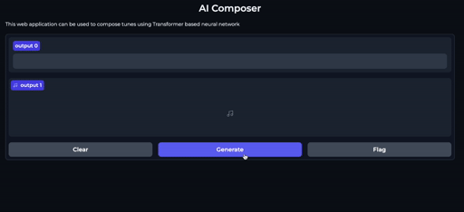

# ABCTransformer

This library enables training decoder-only transformer models to generate music in ABC notation. It also includes scripts for running inference and a simple web application interface.

## Table of Contents
- [Introduction](#introduction)
- [Features](#features)
- [Examples](#examples)
- [Setup](#setup)
- [Usage](#usage)
- [License](#license)


## Introduction
ABCTransformer is designed to facilitate the training of transformer-based models for music generation. It supports music composition in ABC notation, providing tools for model training, inference, and a web-based interface for interaction.

## Features
- Training transformer models for music generation in ABC notation
- Running inference to generate music samples in ABC as well as synthesized WAV files
- Web application interface developed with Gradio allows for easy interaction with the model


## Examples
Here are some examples of music generated by the model trained on The Nottingham Music Database:

<audio controls>
  <source src="generated_samples/notthingam_dataset/2.wav" type="audio/wav">
</audio>
<audio controls>
  <source src="generated_samples/notthingam_dataset/3.wav" type="audio/wav">
</audio>
<audio controls>
  <source src="generated_samples/notthingam_dataset/5.wav" type="audio/wav">
</audio>
<audio controls>
  <source src="generated_samples/notthingam_dataset/6.wav" type="audio/wav">
</audio>
<audio controls>
  <source src="generated_samples/notthingam_dataset/10.wav" type="audio/wav">
</audio>
<audio controls>
  <source src="generated_samples/notthingam_dataset/sample2.wav" type="audio/wav">
</audio>


## Setup

1. **Install Python 3.10**
   Ensure you have Python 3.10 installed. You can use `pyenv` for managing Python versions.
   ```
   pyenv install 3.10.0
   pyenv local 3.10.0
   ```

2. **Install Fluidsynth**
   Fluidsynth is required for audio synthesis.
   ```
   sudo apt install fluidsynth
   ```

3. **Install Requirements**
   Install the necessary Python packages.
   ```
   pip install -r requirements.txt
   ```

## Usage

### Data preprocessing
If you want to use as custom dataset in ABC format you need to preprocess it using `preprocess_datasets.py` script.

### Configs
Model, Tokenizer and Trainer config files are located inside the `config` directory

### Training the Model
To train the model, run:
```
python train.py
```

Run logs and checkpoints are saved inside the `runs` directory

### Autoregressive Decoding Stratedies
If you want to experiment with different decoding strategies and parameters you must modify this line:
```
strategy = TopKSampling(temperature=1.0, k=8)
```
 inside the `generate.py script`. Currently implemented strategies are: `TopKSampling`, `GreedySearch` and `AncestralSampling`


### Generating Samples
To generate a sample, run:
```
python generate.py
```

### Launching the Web Application
To launch the web application, run:
```
python app.py
```

<p align="center">
  
</p>


## License
This project is licensed under the **GNU General Public License v3.0**. See the [LICENSE](LICENSE) file for details.

---
